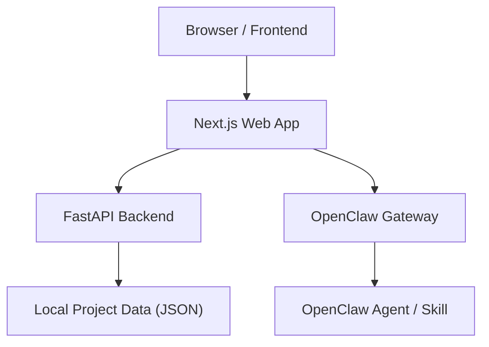

# 研脉 Research Lineage Agent

面向科研选题、论文池构建、知识图谱梳理与研究报告生成的一体化科研助手。

本项目当前已经提供一套可运行的最小产品闭环：

- 研究任务创建
- 检索计划生成
- 论文池浏览与筛选
- 知识图谱可视化
- 研究报告展示
- 与 OpenClaw 智能体联动的对话入口

适合用于验证科研助手产品形态，也适合继续扩展为真实的文献检索与研究分析系统。

## 产品概览

### 核心能力

- **研究任务流转**：从课题输入到结果浏览，形成连续流程
- **论文池管理**：按主题生成候选论文，并支持标记、筛选与查看
- **知识图谱展示**：围绕论文、概念、方向展示结构化关系
- **研究报告输出**：汇总研究背景、主题脉络、研究空白与引用列表
- **智能体交互**：通过 Web 路由连接 OpenClaw Gateway，结合项目上下文进行问答

### 当前版本说明

当前版本是 **mock-first 的可运行原型**：

- 检索计划为规则生成
- 运行进度为模拟流转
- 论文池基于主题种子数据
- 图谱与报告基于本地规则生成

这意味着它已经适合产品演示、交互验证和团队协作开发，但还没有完全接入真实文献数据库与完整分析链路。

## 产品流程图


## 系统架构



## 功能页面

前端当前包含以下页面：

- `/`：首页
- `/projects/new`：新建研究任务
- `/projects/[id]/run`：任务运行页
- `/projects/[id]/papers`：论文目录页
- `/projects/[id]/graph`：知识图谱页
- `/projects/[id]/report`：研究报告页
- `/api/assistant/message`：前端到智能体的桥接接口

## 技术栈

- **Frontend**：Next.js App Router
- **Backend**：FastAPI
- **Shared Models**：Python 数据模型
- **Storage**：本地 JSON 文件
- **Agent Bridge**：OpenClaw Gateway / Proxy / Mock 三种模式

## 仓库结构

```text
research-lineage-agent/
  apps/web/           # 前端应用
  services/api/       # FastAPI 后端
  packages/core/      # 共享数据模型
  data/projects/      # 本地项目数据
  docs/               # 规格、计划、任务、架构文档
```

## 本地启动

如需在本地体验，请按仓库内的前后端说明完成依赖安装、环境变量配置与服务启动。前端会默认连接后端服务，若需要接入 OpenClaw，请在环境变量中补充对应的桥接配置。

## OpenClaw 接入

项目内置 `/api/assistant/message` 作为 Web 与智能体之间的桥接层。

支持三种模式：

- `mock`：仅使用本地项目上下文生成回答
- `proxy`：把请求转发到外部桥接服务
- `gateway`：直接连接本地 OpenClaw Gateway

### Gateway 模式示例

在前端环境配置文件中设置：

```env
OPENCLAW_BRIDGE_MODE=gateway
OPENCLAW_GATEWAY_WS_URL=ws://<gateway-host>:<port>
OPENCLAW_GATEWAY_TOKEN=your_gateway_token
OPENCLAW_GATEWAY_AGENT_ID=main
OPENCLAW_GATEWAY_SESSION_KEY_PREFIX=research-lineage
OPENCLAW_GATEWAY_TIMEOUT_SECONDS=120
OPENCLAW_GATEWAY_SCOPES=operator.admin
```

Gateway 模式下：

- 浏览器仍然只访问你自己的 Next.js 应用
- Next.js 路由会把当前项目上下文转交给 OpenClaw
- 不同项目会使用独立会话，避免上下文串线

## 当前已实现的后端接口

- `POST /api/projects`
- `GET /api/projects`
- `GET /api/projects/{project_id}`
- `POST /api/projects/{project_id}/plan-query`
- `POST /api/projects/{project_id}/run`
- `GET /api/projects/{project_id}/runs/latest`
- `GET /api/projects/{project_id}/papers`
- `PATCH /api/projects/{project_id}/papers/{paper_id}`

## 文档说明

更详细的设计与研发文档位于 [docs](docs)：

- [spec.md](docs/spec.md)
- [plan.md](docs/plan.md)
- [tasks.md](docs/tasks.md)
- [architecture.md](docs/architecture.md)
- [openclaw-integration.md](docs/openclaw-integration.md)

## 适用场景

- 科研选题探索
- 文献综述辅助
- 研究脉络梳理
- 小型科研助手原型开发
- 智能体产品的前后端协同验证

## 当前局限

当前版本仍有以下边界：

- 还未接入真实学术搜索源
- 论文池规模与覆盖面有限
- 图谱布局与视觉表现仍可继续优化
- 报告内容仍以规则拼装为主

## 下一步计划

1. 接入真实检索源与去重逻辑
2. 用真实证据链替换 mock 图谱与报告生成
3. 打通 OpenClaw Skill 与后端 API 的单一数据源
4. 优化图谱交互、页面回链与整体视觉体验

## License

如需开源发布，建议在仓库中补充正式 License 文件后再对外分发。
