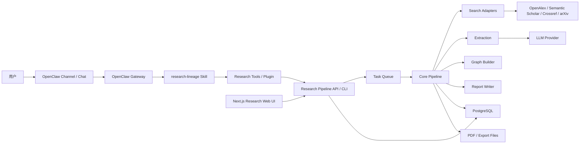
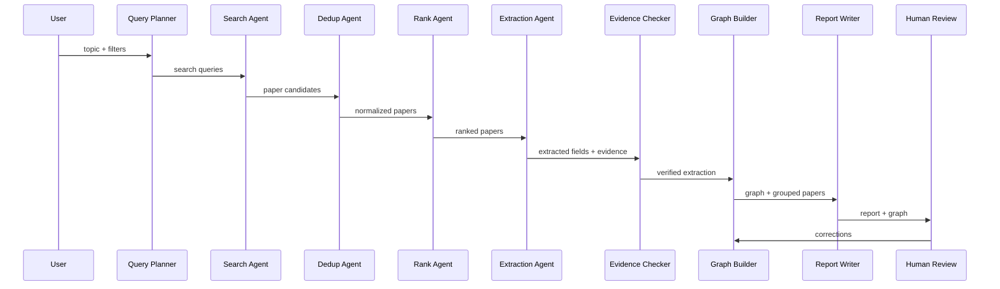

# Research Lineage Agent 架构设计

## 1. 架构目标

Research Lineage Agent 的架构要同时满足三件事：

1. 检索结果可信：论文来源、去重逻辑和排序依据可检查。
2. 抽取结果可追溯：每个关键结论都能回到证据句。
3. 图谱关系可校正：用户能修改错误关系，系统保存反馈。

因此，本项目不采用“一个黑盒大 Agent 直接生成所有结果”的结构，而采用可拆解、可测试、可缓存的流水线架构。

工程实现上，本项目基于 OpenClaw 构建。OpenClaw 提供 Agent gateway、会话入口、skills / plugins 加载和工具调度；Research Lineage Agent 提供科研领域能力。二者通过 `research-lineage` skill / plugin 和 Research Pipeline API / CLI 连接。

## 2. 总体架构



## 3. 分层设计

### 3.0 OpenClaw 层

职责：

- 承载 Agent 会话入口。
- 加载 `research-lineage` workspace skill。
- 在后续阶段加载 code plugin。
- 将用户自然语言请求转成结构化科研调研任务。
- 通过工具调用触发 Research Pipeline。

首期要求：

- 不 fork 或魔改 OpenClaw 核心。
- 使用 workspace skill 完成最小验证。
- pipeline 稳定后再考虑 code plugin。

推荐 workspace 结构：

```txt
research-lineage-agent/
  skills/
    research-lineage/
      SKILL.md
      prompts/
      examples/
```

### 3.1 Web 层

职责：

- 展示任务入口。
- 展示检索配置。
- 展示论文池。
- 展示图谱。
- 展示报告。
- 收集用户校正反馈。

技术：

- Next.js App Router
- TypeScript
- Tailwind CSS
- React Flow
- ECharts

Web 层不直接实现检索、去重、抽取、建图逻辑。首期可以先不做 Web，把 OpenClaw skill 作为 Agent 入口；当 pipeline 输出稳定后，再实现论文池、图谱和报告页面。

### 3.2 API 层

职责：

- 项目 CRUD。
- 启动任务。
- 查询任务状态。
- 查询论文池。
- 查询图谱。
- 查询报告。
- 保存用户反馈。

技术：

- FastAPI
- Pydantic
- SQLAlchemy / SQLModel

API 层只做请求编排和权限边界，不写复杂算法。OpenClaw skill / plugin 和 Web UI 都通过这一层访问 pipeline 能力。

### 3.3 Core Pipeline 层

职责：

- Query Planner。
- Search。
- Dedup。
- Rank。
- Extraction。
- Evidence Check。
- Graph Build。
- Report Write。

这一层应该可以脱离 Web 和 OpenClaw 独立运行，因此早期可以先用 CLI 验证。OpenClaw skill 只负责调用或指导调用这层能力。

### 3.4 Storage 层

职责：

- 保存项目。
- 保存论文。
- 保存来源。
- 保存抽取结果。
- 保存证据。
- 保存图谱节点和边。
- 保存用户反馈。
- 保存任务日志。

首期推荐：

- V0：JSON / CSV。
- V1：PostgreSQL。
- V1.5：PostgreSQL + pgvector 或 Qdrant。

## 4. Agent 流水线



## 5. 模块职责

### 5.1 Query Planner

输入：

- topic
- domain
- goal
- year range
- output preference

输出：

- keyword groups
- search queries
- source strategy

关键约束：

- 输出必须可编辑。
- 对中文 topic 需要生成英文检索词。
- 对垂直领域可以使用本体词表增强。

### 5.2 Search Adapters

每个检索源一个 adapter：

- `OpenAlexAdapter`
- `SemanticScholarAdapter`
- `CrossrefAdapter`
- `ArxivAdapter`

统一接口：

```ts
type SearchAdapter = {
  name: string;
  search(query: SearchQuery): Promise<PaperCandidate[]>;
};
```

统一输出：

```ts
type PaperCandidate = {
  source: string;
  sourceId: string;
  title: string;
  authors: string[];
  year?: number;
  venue?: string;
  doi?: string;
  abstract?: string;
  url?: string;
  citationCount?: number;
  raw?: unknown;
};
```

### 5.3 Dedup

去重流程：

1. 规范化 DOI。
2. 规范化标题。
3. 按 DOI 合并。
4. 按标题相似度合并。
5. 合并 authors、venue、citation count、abstract、source ids。

标题规范化：

- 小写。
- 去除标点。
- 合并空格。
- 去除常见 LaTeX 标记。

### 5.4 Rank

第一版排序可以用可解释规则，不急着上复杂模型。

建议分数：

```txt
final_score =
  0.40 * keyword_relevance +
  0.20 * semantic_relevance +
  0.15 * recency_score +
  0.15 * citation_score +
  0.10 * source_quality
```

排序结果必须保存各子分数，方便用户理解为什么论文排在前面。

### 5.5 Extraction

抽取分两级：

#### 摘要级抽取

输入：

- title
- abstract
- venue
- keywords

输出：

- methods
- metrics
- contributions
- limitations
- applications
- evidence spans

#### PDF 级抽取

输入：

- PDF page chunks
- section text
- tables

输出：

- richer extraction
- page-level evidence
- table-derived metrics

抽取结果必须符合 schema，不允许自由散文直接进入数据库。

### 5.6 Evidence Checker

核心规则：

- 每个 claim 至少有一个 evidence span。
- evidence span 必须标注来源类型：metadata、abstract、pdf。
- PDF evidence 必须有 page。
- 没有证据的 claim 只能低置信度展示。
- 摘要证据不能伪装成全文证据。

### 5.7 Graph Builder

图谱生成策略：

1. 为每篇论文生成 `Paper` 节点。
2. 从抽取字段生成 `Method`、`Metric`、`Problem`、`Application` 节点。
3. 生成基础边：`uses`、`targets`、`achieves`。
4. 对 `improves`、`inherits_from`、`combines_with` 使用更高门槛。
5. 所有边绑定 evidence span。

首期不要过度追求复杂图数据库。PostgreSQL 表即可支撑 MVP。

### 5.8 Report Writer

报告生成依赖：

- ranked papers
- extraction results
- graph nodes
- graph edges
- evidence spans
- user feedback

报告中的每个关键判断都应该带来源。

如果来源不足，写成：

> 初步推测，置信度较低，需要人工进一步确认。

## 6. 数据库表设计

### projects

保存研究任务。

关键字段：

- id
- topic
- goal
- domain
- year_start
- year_end
- status
- created_at
- updated_at

### papers

保存去重后的论文。

关键字段：

- id
- title
- authors
- year
- venue
- doi
- abstract
- url
- citation_count
- relevance_score
- quality_score
- is_kept

### paper_sources

保存每篇论文来自哪些来源。

关键字段：

- id
- paper_id
- source
- source_id
- source_url
- raw_metadata

### extractions

保存结构化抽取结果。

关键字段：

- id
- project_id
- paper_id
- extraction_json
- confidence
- model_name
- created_at

### evidence_spans

保存证据句。

关键字段：

- id
- project_id
- paper_id
- extraction_id
- text
- source_type
- page
- section
- start_offset
- end_offset

### graph_nodes

保存图谱节点。

关键字段：

- id
- project_id
- type
- label
- properties

### graph_edges

保存图谱边。

关键字段：

- id
- project_id
- source_node_id
- target_node_id
- type
- confidence
- evidence_span_ids
- extraction_method
- is_deleted

### user_feedback

保存用户校正。

关键字段：

- id
- project_id
- target_type
- target_id
- action
- before_json
- after_json
- created_at

### task_runs

保存任务执行记录。

关键字段：

- id
- project_id
- stage
- status
- started_at
- finished_at
- error_message
- stats_json

## 7. API 设计草案

### Project

- `POST /api/projects`
- `GET /api/projects`
- `GET /api/projects/{project_id}`
- `PATCH /api/projects/{project_id}`

### Query Planner

- `POST /api/projects/{project_id}/plan-query`

### Task

- `POST /api/projects/{project_id}/run`
- `GET /api/projects/{project_id}/runs/latest`
- `POST /api/projects/{project_id}/runs/{run_id}/retry`

### Papers

- `GET /api/projects/{project_id}/papers`
- `PATCH /api/projects/{project_id}/papers/{paper_id}`
- `POST /api/projects/{project_id}/imports/doi`
- `POST /api/projects/{project_id}/imports/bibtex`

### Graph

- `GET /api/projects/{project_id}/graph`
- `PATCH /api/projects/{project_id}/graph/edges/{edge_id}`
- `DELETE /api/projects/{project_id}/graph/edges/{edge_id}`

### Report

- `GET /api/projects/{project_id}/report`
- `POST /api/projects/{project_id}/report/regenerate`
- `GET /api/projects/{project_id}/exports/markdown`
- `GET /api/projects/{project_id}/exports/bibtex`

### PDF

- `POST /api/projects/{project_id}/papers/{paper_id}/pdf`
- `GET /api/projects/{project_id}/papers/{paper_id}/pdf/status`

## 8. 文件与缓存策略

建议保存：

```txt
data/
  outputs/
    <project_id>/
      papers.json
      papers.csv
      graph_nodes.json
      graph_edges.json
      report.md
  pdfs/
    <paper_id>.pdf
  cache/
    openalex/
    semantic_scholar/
    extraction/
```

缓存规则：

- API 响应按 source + query + year range 缓存。
- 抽取结果按 paper id + prompt version + model name 缓存。
- PDF 解析结果按 file hash 缓存。

## 9. LLM Provider 接口

统一接口：

```ts
type LlmProvider = {
  name: string;
  generateJson<T>(request: JsonGenerationRequest): Promise<T>;
  generateText(request: TextGenerationRequest): Promise<string>;
};
```

要求：

- 所有抽取任务使用 JSON schema。
- prompt version 必须保存。
- model name 必须保存。
- token 用量应该记录。
- LLM 失败时任务可重试。

## 10. 图谱置信度规则

建议初始规则：

- 人工确认：0.95。
- PDF 证据 + 明确关系词：0.80-0.90。
- 摘要证据 + 明确关系词：0.65-0.80。
- 只有模型推断但无证据：不超过 0.40。
- 只有主题相似：不生成 `improves` 或 `inherits_from`，只生成相似候选。

## 11. 安全与合规

- 不自动下载付费论文。
- 用户上传 PDF 仅用于当前项目分析。
- API key 不进入前端。
- 用户上传文件需要限制大小和类型。
- 导出的报告应标注“AI 辅助生成，需要人工复核”。

## 12. 可观测性

每次任务运行需要记录：

- 检索 query 数量。
- 每个 source 返回数量。
- 去重前数量。
- 去重后数量。
- 抽取成功数量。
- 抽取失败数量。
- 图谱节点数量。
- 图谱边数量。
- 有证据边比例。
- LLM token 用量。
- 任务耗时。

这些指标后续可用于优化检索质量和成本。

## 13. 测试策略

### 单元测试

- DOI 标准化。
- 标题标准化。
- 去重逻辑。
- 排序逻辑。
- schema 校验。
- report formatting。

### 集成测试

- OpenAlex adapter mock。
- Semantic Scholar adapter mock。
- CLI 完整流程。
- API 创建任务和查询任务。

### 人工验收

- Demo topic 的 top 20 论文相关性。
- 图谱边可接受率。
- 报告可读性。
- 证据可追溯性。

## 14. 演进路线

### V0

OpenClaw workspace skill + CLI 原型，验证 Agent 入口、检索、去重和报告。

### V1

Web MVP，完成论文池、图谱、报告；OpenClaw 仍作为 Agent 会话入口。

### V1.5

PDF 证据增强，完成页码级证据定位。

### V2

引入向量库、领域模板、更多学科和更强人工反馈记忆。

### V3

考虑 Zotero / EndNote 集成、团队协作和更完整的知识库能力。
