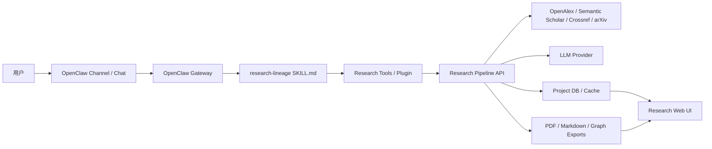

# OpenClaw 集成方案

## 1. 结论

Research Lineage Agent 不从零实现通用 Agent runtime，而是基于 OpenClaw 做领域化封装。

推荐路线：

> OpenClaw 负责 Agent runtime、会话、工具调度、技能加载和多渠道入口；Research Lineage Agent 负责科研文献检索、去重、抽取、证据、图谱和报告。

第一阶段不要 fork 后大改 OpenClaw 核心代码。优先使用 OpenClaw 的 workspace skill / plugin 扩展机制，把科研能力做成独立的 `research-lineage` 技能和必要的工具服务。

## 2. 为什么不直接魔改 OpenClaw 核心

OpenClaw 是通用个人 AI assistant runtime，核心价值在于：

- agent gateway
- 多渠道消息入口
- skills 加载和优先级
- plugin 能力扩展
- workspace 级 agent 行为定制
- 本地运行和工具调度

Research Lineage Agent 是垂直科研产品，核心价值在于：

- 学术检索源适配
- 论文去重和排序
- 文献结构化抽取
- 证据句追溯
- 技术血缘图谱
- 中文调研报告
- 人工校正闭环

这两部分边界清楚。直接改 OpenClaw 核心会带来三个问题：

1. 后续跟进 OpenClaw 上游更新会很痛苦。
2. 科研逻辑和通用 agent runtime 耦合，测试和复用都变难。
3. 项目容易变成“改壳工程”，而不是有独立价值的科研助手。

因此，首选方案是组合：

```txt
OpenClaw runtime + research-lineage skill/plugin + research pipeline service
```

## 3. OpenClaw 能承担什么

根据 OpenClaw 当前公开文档，技能是包含 `SKILL.md` 的目录，可以放在 workspace 的 `skills/` 下；插件也可以携带 skills。技能用于告诉 agent 何时、如何调用工具。

OpenClaw 在本项目中承担：

- 用户和 agent 的对话入口。
- `/research-lineage` 这类命令式触发。
- 多轮任务沟通，例如确认关键词、筛选论文、解释证据。
- 工具调用编排。
- workspace 级技能加载。
- 后续多渠道入口，例如 WebChat、Slack、Discord、微信 / QQ 等。

OpenClaw 不承担：

- 论文检索算法本身。
- 数据库 schema。
- PDF 解析。
- 图谱构建。
- 学术质量评估。
- 报告内容结构化生成规则。

## 4. 推荐集成架构



## 5. 三层实现边界

### 5.1 OpenClaw Skill 层

位置建议：

```txt
research-lineage-agent/
  skills/
    research-lineage/
      SKILL.md
      prompts/
      examples/
```

职责：

- 定义何时激活科研助手。
- 定义用户交互流程。
- 定义安全边界。
- 指导 agent 使用 Research Pipeline API 或 CLI。
- 提醒 agent 所有结论必须带证据和置信度。

首个 skill 目标：

- 用户说“帮我调研某 topic”“生成技术血缘图”“检索论文”时激活。
- 先询问或确认 topic、年份、领域、输出目标。
- 调用检索任务。
- 返回论文池、图谱和报告的链接或文件路径。

### 5.2 Research Pipeline 层

位置建议：

```txt
research-lineage-agent/
  packages/
    core/
  services/
    api/
  scripts/
```

职责：

- Query Planner。
- Search adapters。
- Dedup。
- Rank。
- Extraction。
- Evidence Checker。
- Graph Builder。
- Report Writer。

这一层必须能脱离 OpenClaw 独立测试。原因是检索、去重、抽取和图谱都是产品核心能力，不能只靠 Agent 对话来验证。

### 5.3 Web UI 层

位置建议：

```txt
research-lineage-agent/
  apps/
    web/
```

职责：

- 展示论文池。
- 展示图谱。
- 展示报告。
- 支持人工校正。

Web UI 可以晚于 OpenClaw skill 和 CLI 原型。早期先让 OpenClaw 通过 CLI/API 触发 pipeline，输出 Markdown / JSON / 图谱数据。

## 6. Skill 优先，Plugin 后置

### 第一阶段：workspace skill

先写 `skills/research-lineage/SKILL.md`。

它只负责“教学和编排”：

- 什么时候启动科研调研流程。
- 如何收集参数。
- 如何调用现有 CLI/API。
- 如何解释输出。
- 如何要求证据和低置信度标注。

优点：

- 实现快。
- 不需要深入 OpenClaw 插件 API。
- 后续可以迁移到插件。

### 第二阶段：本地 CLI/API 工具

实现：

- `research-agent search`
- `research-agent extract`
- `research-agent graph`
- `research-agent report`

或提供 FastAPI：

- `POST /projects`
- `POST /projects/{id}/run`
- `GET /projects/{id}/papers`
- `GET /projects/{id}/graph`
- `GET /projects/{id}/report`

OpenClaw skill 通过工具调用这些能力。

### 第三阶段：OpenClaw code plugin

当 CLI/API 稳定后，再考虑做 code plugin：

- 暴露结构化工具给 OpenClaw。
- 打包 skill + tool schemas。
- 更好地处理配置、鉴权和环境变量。

不要在第一天就做 code plugin，除非已经确认 OpenClaw plugin API 和本地开发流程。

## 7. `research-lineage` Skill 草案

```markdown
---
name: research-lineage
description: Research literature lineage assistant for paper search, evidence extraction, technical lineage graphs, and Chinese research reports.
metadata:
  openclaw:
    requires:
      bins: ["research-agent"]
      config: ["researchLineage.workspace"]
---

# Research Lineage Skill

Use this skill when the user wants to search academic papers, map a research field, compare technical routes, extract evidence from papers, or generate a literature review report.

Core workflow:

1. Confirm topic, domain, year range, quality filters, and output goals.
2. Run query planning.
3. Search papers from OpenAlex and Semantic Scholar.
4. Deduplicate and rank papers.
5. Ask the user to review the paper pool when needed.
6. Extract methods, metrics, contributions, limitations, and evidence.
7. Build graph nodes and edges.
8. Generate a Markdown report.
9. Mark unsupported claims as low confidence.

Never present an unsupported claim as fact. Every graph edge and major report claim must include source paper, evidence sentence, and confidence.
```

## 8. OpenClaw 配置建议

本地开发时，可以把技能放在项目 workspace：

```txt
research-lineage-agent/skills/research-lineage/SKILL.md
```

OpenClaw 会优先加载 workspace skills。也可以通过 `skills.load.extraDirs` 指向独立技能目录。

建议配置项：

```json5
{
  skills: {
    entries: {
      "research-lineage": {
        enabled: true,
        env: {
          RESEARCH_LINEAGE_API_URL: "http://localhost:8000",
          OPENALEX_EMAIL: "your-email@example.com",
          S2_API_KEY: "optional-semantic-scholar-key"
        }
      }
    }
  },
  agents: {
    list: [
      {
        id: "research-assistant",
        skills: ["research-lineage"]
      }
    ]
  }
}
```

实际字段以本机 OpenClaw 版本为准。配置写入前要先用 OpenClaw 官方命令验证当前版本的 schema。

## 9. 下一步执行顺序

### Step 1：运行 OpenClaw

- 安装 Node 24 或 Node 22.19+。
- 安装 OpenClaw。
- 完成 `openclaw onboard`。
- 验证 `openclaw gateway status`。
- 验证可以发一条普通 agent 消息。

### Step 2：创建最小 skill

- 创建 `skills/research-lineage/SKILL.md`。
- 先不接真实检索，只让 skill 识别“科研调研”请求。
- 用 `openclaw skills list` 验证加载。
- 用 `openclaw agent --message "帮我调研谐振腔天线"` 验证触发。

### Step 3：实现本地 CLI mock

- 创建 `research-agent search`。
- 输入 topic。
- 输出 mock `papers.json` 和 `report.md`。
- 让 OpenClaw skill 调用或指导调用该 CLI。

### Step 4：接 OpenAlex / Semantic Scholar

- 替换 mock 数据。
- 保持输出 schema 不变。
- 保存 API 原始响应摘要，便于调试。

### Step 5：接抽取、图谱、报告

- 摘要级抽取。
- 证据句。
- 图谱 JSON。
- Markdown 报告。

### Step 6：再做 Web UI

- Web 不急着第一天做。
- 等 pipeline 输出稳定后，再做论文池、图谱页和报告页。

## 10. 需要调整的原文档

四份文档都保留，但需要更新侧重点：

- `spec.md`：增加“基于 OpenClaw 的实现约束”，产品需求不变。
- `plan.md`：增加 OpenClaw 技术预研里程碑，技术栈从“自建 Agent”改为“OpenClaw + Research Pipeline”。
- `tasks.md`：增加 OpenClaw 安装、skill 创建、skill 触发验证、CLI mock 任务。
- `architecture.md`：总架构改为 OpenClaw Gateway + Research Skill/Plugin + Research Pipeline + Web UI。

## 11. 风险与应对

### 风险：OpenClaw 版本变化快

应对：

- 不改核心。
- 固定一个 OpenClaw 版本做 MVP。
- 把科研能力放在独立 repo / 独立模块。

### 风险：skill 只能写提示，不能承载复杂工具

应对：

- skill 只做流程说明。
- 复杂能力放到 CLI/API。
- 稳定后再做 code plugin。

### 风险：用户以为“套壳”就是换 UI

应对：

- 第一版先证明科研能力：30 篇候选论文、去重、证据、图谱、报告。
- UI 和品牌可以后置。

### 风险：Agent 胡乱调用 shell 或处理用户输入

应对：

- 所有 CLI 参数结构化。
- 不拼接不可信 shell 字符串。
- 对 topic、年份、数量做校验。
- 外部 API key 只放服务端环境变量。

## 12. 决策记录

- 采用 OpenClaw 作为 Agent runtime。
- 首期不 fork OpenClaw 核心。
- 首期先写 workspace skill，不先写 code plugin。
- Research Pipeline 必须能独立运行和测试。
- Web UI 后置到 pipeline 稳定之后。
