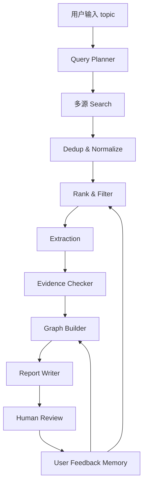

# Research Lineage Agent 实施计划

## 1. 项目目标

用 12 周完成一个可运行、可演示、可内测的科研文献智能体 MVP。

实现策略：

> 基于 OpenClaw 做 Agent 底座，把科研能力做成 `research-lineage` skill / plugin 和独立 Research Pipeline。

核心闭环：

1. 用户输入 topic。
2. 系统扩展关键词和检索式。
3. 系统从公开学术数据源检索论文。
4. 系统去重、排序、筛选论文。
5. 系统抽取结构化信息和证据。
6. 系统生成技术血缘图谱。
7. 系统生成中文调研报告。
8. 用户校正论文池和图谱关系。

## 2. 建议技术栈

### 前端

- OpenClaw channel / chat 入口：首期优先使用。
- Next.js App Router
- TypeScript
- Tailwind CSS
- React Flow
- ECharts

### 后端

- OpenClaw Gateway：Agent runtime 和 skill / plugin 加载。
- Python
- FastAPI
- Pydantic
- SQLAlchemy 或 SQLModel

### OpenClaw 扩展

- V0-pre：workspace skill，位置为 `skills/research-lineage/SKILL.md`。
- V0 / V1 早期：skill 调用或指导调用本地 CLI / API。
- V1 稳定后：按需封装 OpenClaw code plugin。

### 异步任务

- V0 / V1 早期：OpenClaw skill + FastAPI BackgroundTasks 或本地命令行任务。
- V1 稳定后：RQ 或 Celery。
- 队列依赖：Redis。

### 数据存储

- V0：本地 JSON / CSV。
- V1：PostgreSQL。
- 图谱首期：PostgreSQL 表模拟。
- 向量检索：pgvector 或 Qdrant，V1.5 后再接。

### PDF 解析

- 首期：PyMuPDF。
- 后续：GROBID、Marker 或其他结构化解析工具。

### LLM Provider

- 用统一接口封装 provider。
- 首期支持 OpenAI-compatible API。
- 后续支持 OpenAI、Claude、DeepSeek、通义等。

### 检索 API

- OpenAlex。
- Semantic Scholar。
- Crossref。
- arXiv。

## 3. 选型理由

- OpenClaw 适合承载 Agent 会话入口、skill 编排和多渠道交互。
- Next.js 适合在 pipeline 稳定后搭建可演示 Web MVP。
- FastAPI 适合承载检索、抽取和任务状态 API。
- PostgreSQL 能同时支持业务表、图谱边表和后续 pgvector。
- React Flow 适合快速实现可交互技术图谱。
- 先不用 Neo4j，降低部署复杂度。
- 不魔改 OpenClaw 核心，避免后续难以跟进上游更新。

## 4. 推荐开发原则

1. 先验证 OpenClaw skill，再做 pipeline CLI / API，最后做 Web。
2. skill 只做流程编排，检索、抽取、图谱和报告放在可测试 pipeline。
3. 先检索和去重，后图谱。
4. 先摘要级抽取，后 PDF 证据定位。
5. 先固定一个 Demo topic，后扩展多个方向。
6. 每一步都输出可检查文件或页面。
7. 没有证据的结论必须低置信度展示。
8. 用户校正是核心功能，不是后续装饰。

## 5. 项目目录建议

```txt
research-lineage-agent/
  docs/
    spec.md
    plan.md
    tasks.md
    architecture.md
    openclaw-integration.md
  skills/
    research-lineage/
      SKILL.md
  apps/
    web/
  services/
    api/
  packages/
    core/
  data/
    samples/
    outputs/
  scripts/
  tests/
```

早期也可以先用单 Python 包实现 CLI，再迁移到上述结构。OpenClaw skill 应该调用稳定的 CLI / API，而不是直接承载复杂业务逻辑。

## 6. 页面与路由设计

### `/`

首页 / 任务入口。只放 topic 输入、研究目标和最近任务，不做营销页。

### `/projects/new`

检索配置页。展示 Query Planner 生成的关键词、检索式、数据源和筛选条件。

### `/projects/:id/run`

任务运行页。展示当前 Agent 阶段和日志。

### `/projects/:id/papers`

论文池。展示论文表格、筛选、保留 / 剔除、手动导入。

### `/projects/:id/graph`

图谱页。左侧过滤器，中间 React Flow，右侧节点 / 边详情和证据。

### `/projects/:id/report`

报告页。展示 Markdown 报告、引用列表、导出按钮。

## 7. 后端模块设计

### 7.1 Project 模块

负责创建任务、保存配置、查询任务状态。

关键文件建议：

- `services/api/app/routes/projects.py`
- `packages/core/models/project.py`

### 7.2 Query Planner 模块

负责关键词扩展和检索式生成。

输入：

- topic
- domain
- goal
- year range

输出：

- keyword groups
- search queries
- source strategy

### 7.3 Search 模块

负责调用 OpenAlex、Semantic Scholar、Crossref、arXiv。

要求：

- 每个 source 独立 adapter。
- 统一输出 `PaperCandidate`。
- 保存原始响应摘要，便于调试。

### 7.4 Dedup & Rank 模块

负责去重、合并元数据和排序。

去重优先级：

1. DOI 精确匹配。
2. 规范化标题精确匹配。
3. 标题相似度 + 年份 + 第一作者。

排序特征：

- keyword match
- semantic relevance
- recency
- citation count
- source quality

### 7.5 Extraction 模块

负责结构化抽取。

V1 输入：

- title
- abstract
- venue
- metadata

V1.5 输入：

- PDF text chunks
- section text
- tables

输出：

- methods
- metrics
- contributions
- limitations
- evidence spans

### 7.6 Graph Builder 模块

负责从抽取结果生成节点和边。

首期策略：

- 先生成 `Paper -> uses -> Method`。
- 再生成 `Method -> targets -> Metric`。
- 再生成 `Paper -> achieves -> Metric`。
- `improves` 和 `inherits_from` 需要更谨慎，低置信度或人工确认后展示。

### 7.7 Evidence Checker 模块

负责检查每条边和报告结论是否有证据。

规则：

- 无 evidence span 的关系不能高置信度展示。
- 摘要证据和 PDF 证据必须区分。
- PDF 证据需要保存页码或段落位置。

### 7.8 Report Writer 模块

负责生成 Markdown 报告。

报告结构：

1. 检索配置。
2. 论文池概览。
3. 技术路线分组。
4. 技术实体表。
5. 指标对比表。
6. 技术血缘图说明。
7. 研究空白建议。
8. 引用列表。

## 8. 数据流



## 9. 里程碑拆分

### M0：项目文档与骨架

目标：把 PRD 变成可开发文档和目录结构。

交付：

- `docs/spec.md`
- `docs/plan.md`
- `docs/tasks.md`
- `docs/architecture.md`
- `docs/openclaw-integration.md`
- 项目目录骨架

验证：

- 五份文档范围一致。
- 第一版 Demo topic 明确。

### M0.5：OpenClaw 底座验证

目标：确认 OpenClaw 可以承载 Research Lineage Agent 的会话入口和技能编排。

交付：

- 本地 OpenClaw 可运行。
- `skills/research-lineage/SKILL.md` 最小技能。
- research assistant agent 配置草案。
- mock pipeline 输出 `papers.json` 和 `report.md`。

验证：

- `openclaw skills list` 能看到 `research-lineage`。
- `openclaw agent --message "帮我调研谐振腔天线"` 能触发科研调研流程。
- skill 不直接写复杂科研逻辑，只调用或指导调用 pipeline。

### M1：CLI 检索原型

目标：从 topic 自动获取候选论文。

交付：

- CLI 命令。
- OpenAlex adapter。
- Semantic Scholar adapter。
- 标准 Paper 数据结构。
- JSON / CSV 输出。

验证：

- Demo topic 返回至少 30 篇候选论文。
- 输出文件可读。

### M2：去重、排序和论文池

目标：得到可人工检查的论文池。

交付：

- DOI 去重。
- 标题相似度去重。
- 基础排序。
- 论文池导出。

验证：

- 对 Demo topic 人工抽查重复项。
- top 20 相关性人工通过率达到初步可用水平。

### M3：摘要级抽取与 Markdown 报告

目标：生成第一版调研报告。

交付：

- 结构化抽取 schema。
- LLM 抽取或规则 + LLM 混合抽取。
- Markdown 报告。
- 证据句字段。

验证：

- 每篇论文至少抽取 5 类字段。
- 报告中关键结论有来源。

### M4：Web MVP 骨架

目标：把 CLI 能力接到 Web 上。

交付：

- Next.js 页面骨架。
- FastAPI 项目接口。
- 创建项目、任务配置、论文池页面。
- 本地任务状态展示。

验证：

- 用户能通过网页创建任务并看到论文池。

### M5：图谱与证据面板

目标：实现可交互技术血缘图。

交付：

- graph node / edge schema。
- React Flow 图谱页。
- 节点详情。
- 边证据面板。
- 用户修改 / 删除边。

验证：

- Demo topic 生成可解释图谱。
- 图谱边可查看证据和置信度。

### M6：PDF 上传与证据定位

目标：从摘要级证据升级到原文级证据。

交付：

- PDF 上传。
- PyMuPDF 文本解析。
- 页码级证据 span。
- 对保留论文执行深抽取。

验证：

- 用户上传 PDF 后，关键抽取字段可定位到页码。

### M7：评测、内测和打磨

目标：准备校园内测。

交付：

- 3 个验收 topic。
- 人工评测表。
- 手动测试清单。
- Demo script。
- 错误处理和缓存优化。

验证：

- 每个 topic 可完整跑通。
- 有明确的人工评分结果。

## 10. 12 周排期

### 第 1-2 周：原型

- 完成项目骨架。
- 完成 OpenClaw 本地运行验证。
- 完成 `research-lineage` workspace skill。
- 完成 OpenAlex / Semantic Scholar 检索。
- 完成论文池和基础去重。

### 第 3-4 周：抽取

- 完成摘要级结构化抽取。
- 完成技术实体表。
- 完成 Markdown 报告。

### 第 5-6 周：图谱

- 完成节点 / 边 schema。
- 完成 React Flow 图谱。
- 完成证据面板。

### 第 7-8 周：PDF 与证据

- 完成 PDF 上传。
- 完成正文解析。
- 完成证据句定位。
- 完成低置信度标注。

### 第 9-10 周：校园内测

- 找 20-30 名同学试用。
- 收集任务日志。
- 收集人工评分。

### 第 11-12 周：打磨发布

- 优化交互。
- 优化导出。
- 增加模板。
- 完善错误处理。
- 准备校内推广。

## 11. 风险与应对

### 风险 1：图谱关系不准

应对：

- 每条边必须有证据和置信度。
- 允许用户校正。
- `improves` / `inherits_from` 先低置信度展示。

### 风险 2：论文获取不完整

应对：

- 支持 DOI / BibTeX / PDF 手动导入。
- 不依赖自动下载付费全文。
- 多源检索结果合并。

### 风险 3：分区数据难维护

应对：

- V1 不把分区作为硬依赖。
- 允许用户上传分区表。
- 显示数据来源和更新时间。

### 风险 4：LLM 成本高

应对：

- 先摘要级抽取。
- PDF 深抽取只对用户保留论文执行。
- 缓存所有抽取结果。
- 对不同 Agent 步骤使用不同模型。

### 风险 5：产品变成炫技图谱

应对：

- 验收指标绑定真实任务：开题、综述、组会、找创新点。
- 报告和指标表必须和图谱同时交付。

## 12. 参考项目启发

- PaperQA：学习 grounded answer、引用归因、metadata-aware retrieval 和缓存。
- GraphRAG：学习从非结构文本抽实体和关系，但不要早期引入重型索引。
- STORM：学习多视角提问、检索、大纲和报告生成。
- OpenScholar：学习科学文献 RAG、Semantic Scholar 检索、rerank 和 citation attribution。
- Scholar-Agent：学习 FastAPI、React、Redis / Celery 和多技能研究助手架构。
- ZoteroRAG：学习 local-first PDF indexing、SQLite / FAISS 和本地文献库思路。
